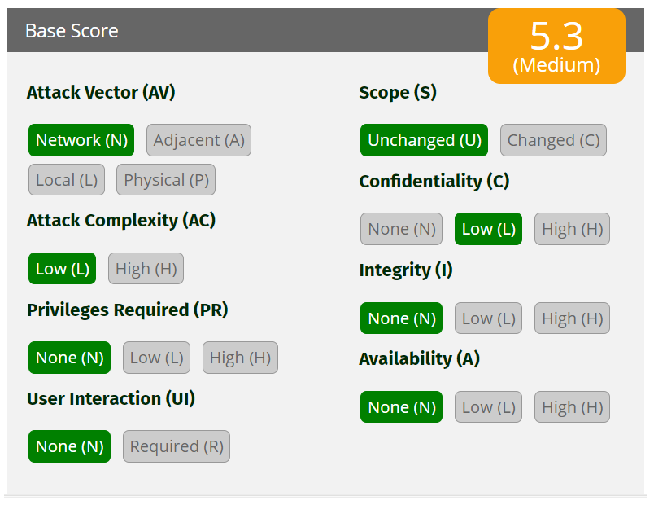
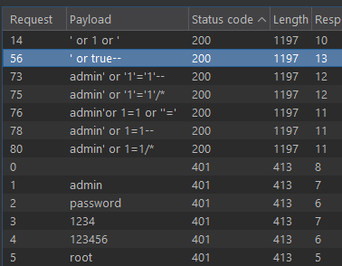
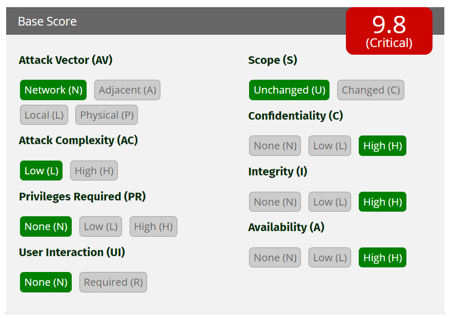
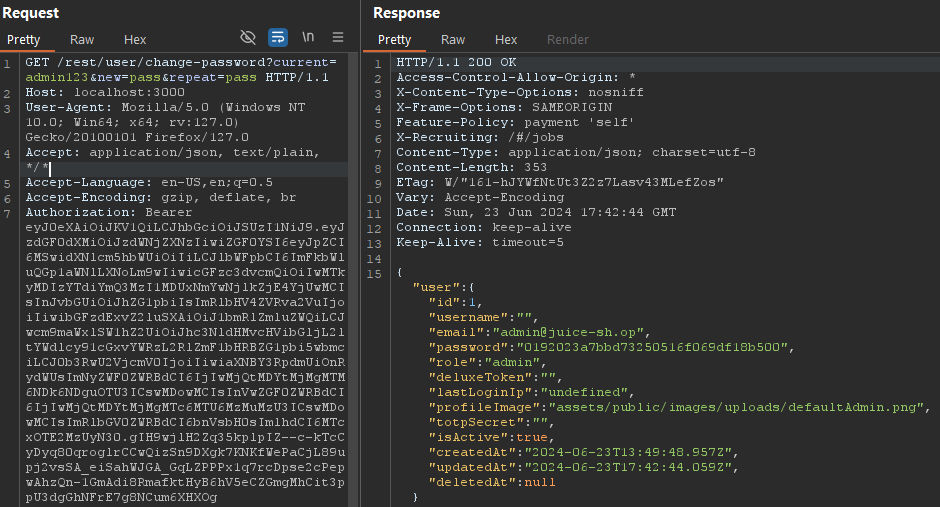
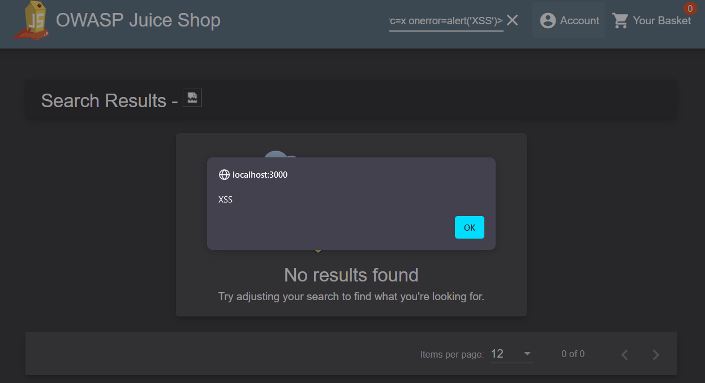
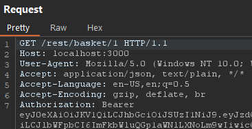
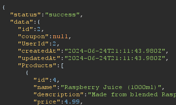
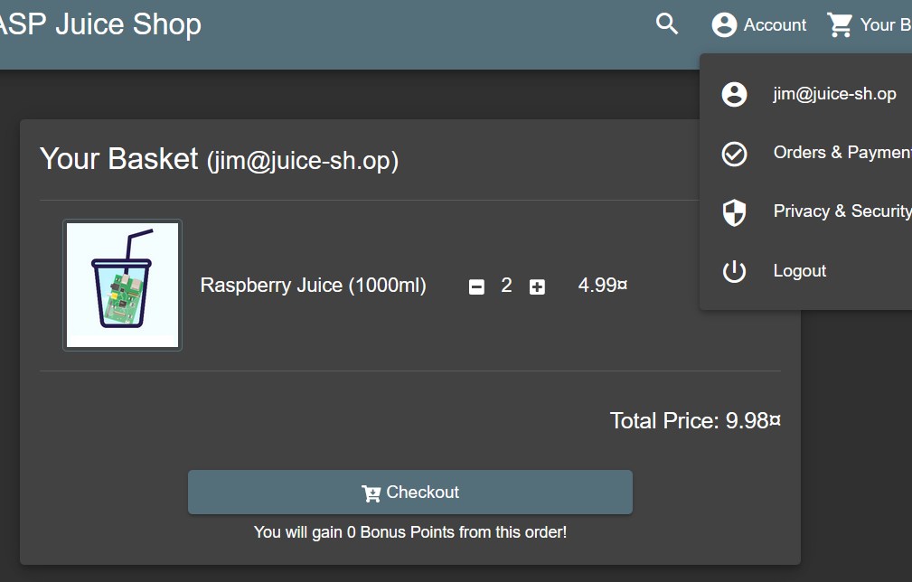
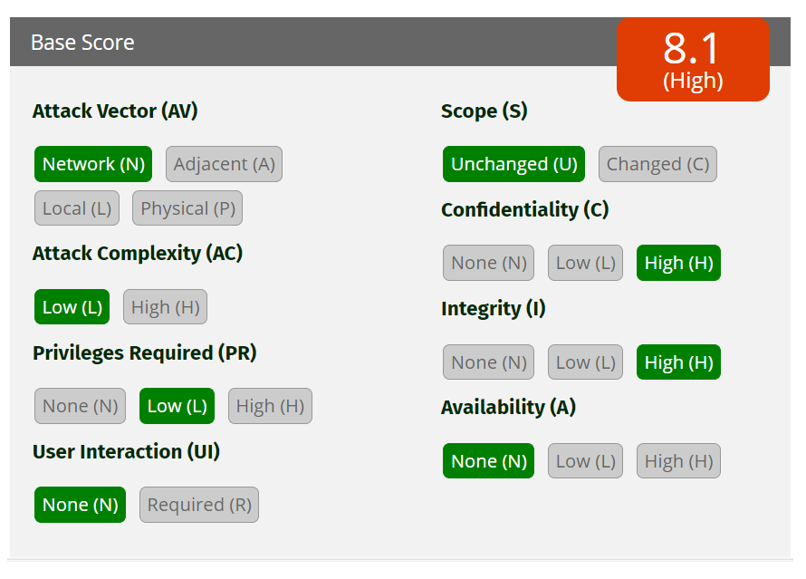

# Web Application Security Report: OWASP Juice Shop
- [Web Application Security Report: OWASP Juice Shop](#web-application-security-report-owasp-juice-shop)
  - [Summary](#summary)
  - [Tools](#tools)
  - [1 - Directory Listing Exposure in '/ftp'](#1---directory-listing-exposure-in-ftp)
  - [2 - Sensitive Data Exposure in Main.js](#2---sensitive-data-exposure-in-mainjs)
  - [3 - SQL Injection Brute Force in User Login](#3---sql-injection-brute-force-in-user-login)
  - [4 - SQL Injection in Product Search](#4---sql-injection-in-product-search)
  - [5 - Weak Password Hashing (MD5)](#5---weak-password-hashing-md5)
  - [6 - Cross-Site Request Forgery (CSRF) in Change Password Functionality](#6---cross-site-request-forgery-csrf-in-change-password-functionality)
  - [7 - DOM XSS in Product Search](#7---dom-xss-in-product-search)
  - [8 - Broken Access Control in Basket Functionality](#8---broken-access-control-in-basket-functionality)
  - [9 - Improper Input Validation in Basket Functionality](#9---improper-input-validation-in-basket-functionality)


## Summary

OWASP Juice Shop is an intentionally insecure web application written in Node.js, Express, and Angular. It includes vulnerabilities from the entire OWASP Top Ten and many other security flaws found in real-world applications. This project serves as a practical guide for understanding and mitigating web application security issues.

This report is part of the Web Application Security course in the Specialization in Cybersecurity from [Cesar School](https://cesar.school).

For more information on OWASP Juice Shop, visit the [official OWASP Juice Shop page](https://owasp.org/www-project-juice-shop/).

**Installation**

To set up OWASP Juice Shop locally, follow the instructions on the [official GitHub repository](https://github.com/juice-shop/juice-shop).

For Docker users, simply run:
```sh
docker run --rm -p 127.0.0.1:3000:3000 bkimminich/juice-shop
```

**Assessment**

The assessment includes identifying vulnerabilities, understanding exploitation techniques, evaluating their severity, and suggesting remediation strategies.

Each vulnerability is mapped to its corresponding [CWE (Common Weakness Enumeration)](https://cwe.mitre.org/) and evaluated using the [Common Vulnerability Scoring System (CVSS)](https://www.first.org/cvss/) calculator.


## Tools

- [Burp Suite Community Edition](https://portswigger.net/burp)
- [Sqlmap](https://sqlmap.org/)
- [CrackStation](https://crackstation.net/)
- [FoxyProxy](https://getfoxyproxy.org/)
- [Firefox](https://www.mozilla.org/)
- [Docker](https://www.docker.com/)
- [Kali Linux](https://www.kali.org/)
- [Ubuntu](https://ubuntu.com/)
- [Windows Subsystem for Linux](https://learn.microsoft.com/windows/wsl/)

## 1 - Directory Listing Exposure in '/ftp'


Burp Suite -> Target -> Site map

By accessing the `/ftp` directory directly, files available for download can be seen. 


For example, the `acquisitions.md` file contains sensitive information about the company's acquisitions.


**CWE ID**:
- [CWE-538: File and Directory Information Exposure](https://cwe.mitre.org/data/definitions/538.html)

**Severity**: 7.5 (High) - Unauthorized access to sensitive company information.


**Remediation**: Implement proper access control and disable directory listing.


## 2 - Sensitive Data Exposure in Main.js

Inspecting `main.js` in the developer tools debugger with Pretty Print reveals critical internal information. 


For instance, searching for 'admin' exposes the administration panel, which may displays user information and customer feedback control.


**CWE ID**:
- [CWE-922: Insecure Storage of Sensitive Information](https://cwe.mitre.org/data/definitions/922.html)

**Severity**: 5.3 (Medium) - Exposure of internal endpoints and application logic.



**Remediation**: Minimize information exposure in client-side code and use obfuscation where possible.

## 3 - SQL Injection Brute Force in User Login

The login form is vulnerable to SQL injection. By entering `' OR 1=1 --` in the Email field and anything in the password field, the application logs in as the first user in the database (the admin user). By exploiting this vulnerability, the attacker can escalate privileges, gaining administrative access to the application and enabling multiple further attacks.


Using Burp Suite Intruder tool configured with a [list](https://book.hacktricks.xyz/pentesting-web/login-bypass/sql-login-bypass) of SQL Injection payloads to automate and test the vulnerability in the login form.




**CWE ID**: 
- [CWE-89: SQL Injection](https://cwe.mitre.org/data/definitions/89.html)


**Severity**: 10 (Critical) - Potential to gain administrative access to the application.


**Remediation**: Implement parameterized queries and use prepared statements.


## 4 - SQL Injection in Product Search

The search field in the application is vulnerable to SQL injection. By using tools like Burp Suite and [sqlmap](https://sqlmap.org/), the entire database schema and data were collected. This included registered [credit cards](db/Cards.csv) in plain text and all [users](db/Users.csv) information, although passwords were encrypted.


**CWE ID**: 
- [CWE-89: SQL Injection](https://cwe.mitre.org/data/definitions/89.html)

**Severity**: 9.8 (Critical) - Full database access and data exfiltration.



**Remediation**: Use parameterized queries, validate and sanitize inputs, and implement robust access controls.

## 5 - Weak Password Hashing (MD5)

By examining the user table, it was detected that the password hashes are stored using the MD5 hashing algorithm. Using a rainbow table attack via the online tool [CrackStation](https://crackstation.net/), 4 passwords were successfully decrypted. Further research and use of more comprehensive rainbow tables could potentially lead to the decryption of more passwords.


**CWE ID**:
- [CWE-328: Reversible One-Way Hash](https://cwe.mitre.org/data/definitions/328.html)

**Severity**:  9.1 (Critical) - Unauthorized access to user and admin accounts through password decryption.


**Remediation**: Replace MD5 with a more secure hashing algorithm. Additionally, implement salting and peppering techniques to enhance password security.

## 6 - Cross-Site Request Forgery (CSRF) in Change Password Functionality

The change password functionality is vulnerable to CSRF attacks. Using Burp Suite's Repeater tool, the password could be changed directly by altering the request. When the current password value was set incorrectly, it led to an error. However, by removing the current password value, the password change was successfully executed, allowing the attacker to change the password without knowing the actual current password.

The request with the correct current password successfully changes the password:




The request with an incorrect current password leads to an error:❌


The request without the current password value successfully changes the password: ✅


Obs.: The vulnerability did not work on an updated version of Firefox due to built-in browser protections, making it harder to reproduce the attack on a victim's computer. However, other methods, such as using Burp Suite, older browsers, or custom scripts, could still be used to exploit this vulnerability.

**CWE ID**:
- [CWE-352: Cross-Site Request Forgery (CSRF)](https://cwe.mitre.org/data/definitions/352.html)

**Severity**: 8.0 (High) - Unauthorized actions performed on behalf of authenticated users.


**Remediation**: Implement anti-CSRF tokens to validate the authenticity of requests. Ensure that all state-changing requests require a unique token that is verified on the server-side.

## 7 - DOM XSS in Product Search

The product search functionality is vulnerable to DOM-based XSS. DOM-based XSS occurs when the attack payload is executed as part of the Document Object Model (DOM) on the client side, without any interaction with the server. 

By entering the payload in the browser´s search bar, the application executes the script in the context of the user's browser.

**Payloads:**

1. **Basic Script Alert** ❌
    ```html
    <script>alert('XSS');</script>
    ```
    This payload did not work as the script was sanitized.

2. **Image Tag with onerror Attribute** ✅
    ```html
    
    ```
    This payload triggered an alert box, demonstrating the presence of an XSS vulnerability.

    

3. **Simple Redirect Link** ✅
    ```html
    <a href="https://cesar.school/">Clique</a>
    ```
    This payload created a link that, when clicked, redirected the user to another page.

    

4. **Image Tag with onerror Redirect** ✅
    ```html
    
    ```
    This payload straight redirected the user upon triggering the onerror event.

5. **Cookie Stealing** ✅
   ```html
    <iframe src="javascript:alert(document.cookie)">
    ```
    
    This payload triggered an alert showing the user's cookies.

**CWE ID**:
- [CWE-79: Improper Neutralization of Input During Web Page Generation ('Cross-site Scripting')](https://cwe.mitre.org/data/definitions/79.html)

**Severity**: 5.4 (Medium) - Potential to execute arbitrary JavaScript in the user's browser.


**Remediation**: 
1. Implement proper input validation and output encoding.
2. Use security libraries and frameworks that handle these issues automatically.

## 8 - Broken Access Control in Basket Functionality

The basket functionality has broken access control vulnerabilities, allowing unauthorized actions on behalf of other users.

**View other users baskets**

By manipulating the request to view a basket, it was possible to access other users baskets. Using Burp Suite's Repeater tool, the HTTP header was modified to `/rest/basket/*`, with `*` being the user ID. This allowed viewing the contents of other users' baskets.

- Original request:

    

- Altered request:

    

- Reponse
  
  The response shows the basket of the user with ID 2:

    

Jim's basket was accessed, revealing his items and personal information.




**Add items to other users baskets**

It was possible to add items to other users baskets by manipulating the request to add an item. This involved intercepting the request and altering the BasketId parameter.

- Original request:

    User `admin` -> BasketId `1`

    Product `Eggfruit Juice` -> ProductId `3`

    
    
Trying to simply change the `BasketId` to `2` didn´t work, but adding a duplicated `BasketId` parameter with the value `2` worked.

- Altered request:
  
    User `Jim` -> BasketId `2`
    Quantity -> `10`

    

- Successful Response:
  
    
   

Attempting to add more items to the basket on basket page using a `PUT` request or using Burp Suite's Repeater tool was unsuccessful. The vulnerability could only be exploited through the "Add to Basket" functionality on the main page by intercepting and modifying the request.


**CWE ID**:
- [CWE-284: Improper Access Control](https://cwe.mitre.org/data/definitions/284.html)

**Severity**: 8.1 (High) - Unauthorized actions performed on behalf of other users, including viewing and modifying basket contents.



**Remediation**: 
Implement proper access control checks on both server-side and client-side.
Validate user permissions for each action to ensure users can only access and modify their own resources.

## 9 - Improper Input Validation in Basket Functionality


