# Web Application Security Report: OWASP Juice Shop

## Table of Contents
- [Web Application Security Report: OWASP Juice Shop](#web-application-security-report-owasp-juice-shop)
  - [Table of Contents](#table-of-contents)
  - [Executive Summary](#executive-summary)
    - [Approach](#approach)
    - [Scope](#scope)
    - [Tools](#tools)
  - [Summary of Findings](#summary-of-findings)
  - [Remediation Summary](#remediation-summary)
  - [Technical Finding Details](#technical-finding-details)
    - [1 - Directory Listing Exposure in '/ftp'](#1---directory-listing-exposure-in-ftp)
    - [2 - Sensitive Data Exposure in Main.js](#2---sensitive-data-exposure-in-mainjs)
    - [3 - SQL Injection Brute Force in User Login](#3---sql-injection-brute-force-in-user-login)
    - [4 - SQL Injection in Product Search](#4---sql-injection-in-product-search)
    - [5 - Weak Password Hashing (MD5)](#5---weak-password-hashing-md5)
    - [6 - Cross-Site Request Forgery (CSRF) in Change Password Functionality](#6---cross-site-request-forgery-csrf-in-change-password-functionality)
    - [7 - DOM XSS in Product Search](#7---dom-xss-in-product-search)
    - [8 - Broken Access Control in Basket Functionality](#8---broken-access-control-in-basket-functionality)
    - [9 - Improper Input Validation in Basket Functionality](#9---improper-input-validation-in-basket-functionality)
    - [10 - Improper Input Validation in File Upload Functionality](#10---improper-input-validation-in-file-upload-functionality)
    - [11 - Insecure Design and Implementation of JWT](#11---insecure-design-and-implementation-of-jwt)
  - [Author](#author)

## Executive Summary

### Approach

The approach for this assessment involved systematically identifying vulnerabilities in the OWASP Juice Shop application. The assessment focused on understanding exploitation techniques, evaluating the severity of each vulnerability, and suggesting remediation strategies to mitigate. Each identified vulnerability was mapped to its corresponding [CWE (Common Weakness Enumeration)](https://cwe.mitre.org/) and evaluated using the [Common Vulnerability Scoring System (CVSS)](https://www.first.org/cvss/) calculator to provide a standardized severity rating.

### Scope

The scope of this security assessment covered the OWASP Juice Shop application, which is an intentionally insecure web application used for educational purposes.The following components were included in the assessment:
- Application endpoints
- User authentication mechanisms
- Data storage practices
- Input validation processes
- Access control measures

### Tools
- [Burp Suite Community Edition](https://portswigger.net/burp)
- [JWT Editor Burp Extension](https://portswigger.net/bappstore/26aaa5ded2f74beea19e2ed8345a93dd)
- [Sqlmap](https://sqlmap.org/)
- [CrackStation](https://crackstation.net/)
- [Hashcat](https://hashcat.net/)
- [JWT.io](https://jwt.io/)
- [FoxyProxy](https://getfoxyproxy.org/)
- [Firefox](https://www.mozilla.org/)
- [Docker](https://www.docker.com/)
- [Kali Linux](https://www.kali.org/)
- [Ubuntu](https://ubuntu.com/)
- [Windows Subsystem for Linux](https://learn.microsoft.com/windows/wsl/)

## Summary of Findings

| Finding # | Severity Level | Finding Name                                          | Severity Score |
|-----------|----------------|-------------------------------------------------------|----------------|
| 1         | High           | Directory Listing Exposure in '/ftp'                  | 7.5            |
| 2         | Medium         | Sensitive Data Exposure in Main.js                    | 5.3            |
| 3         | Critical       | SQL Injection Brute Force in User Login               | 10             |
| 4         | Critical       | SQL Injection in Product Search                       | 9.8            |
| 5         | Critical       | Weak Password Hashing (MD5)                           | 9.1            |
| 6         | High           | Cross-Site Request Forgery (CSRF) in Change Password  | 8.0            |
| 7         | Medium         | DOM XSS in Product Search                             | 5.4            |
| 8         | High           | Broken Access Control in Basket Functionality         | 8.1            |
| 9         | Medium         | Improper Input Validation in Basket Functionality     | 6.5            |
| 10        | High           | Improper Input Validation in File Upload Functionality| 9.8            |
| 11        | High           | Insecure Design and Implementation of JWT             | 7.1            |


## Remediation Summary

As a result of this assessment, there are several opportunities to strengthen the security of the OWASP Juice Shop application. Remediation efforts are prioritized below, starting with those that will likely take the least amount of time and effort to complete. It is essential to ensure that all remediation steps and mitigating controls are carefully planned and tested to prevent any service disruptions or loss of data.

**General Recommendations**
- Implement Proper Access Control: Ensure that all directories and files are properly secured and access is restricted to authorized users only.
- Use Secure Password Hashing Algorithms: Replace MD5 with a more secure hashing algorithm and implement salting and peppering techniques.
- Enforce Strong Input Validation: Validate and sanitize all user inputs to prevent SQL injection and XSS attacks.
- Implement Anti-CSRF Tokens: Ensure that all state-changing requests require a unique token that is verified on the server-side.
- Use Strong JWT Algorithms: Use stronger algorithms such as HS512 for token signing and ensure tokens have a short expiration time.
  
**Short Term**  
- [Finding 1](#1---directory-listing-exposure-in-ftp): Disable Directory Listing on the affected web server.  
- [Finding 2](#2---sensitive-data-exposure-in-mainjs): Minimize information exposure in client-side code and use obfuscation where possible.  
- [Finding 5](#5---weak-password-hashing-md5): Replace MD5 with a more secure hashing algorithm. Additionally, implement salting and peppering techniques to enhance password security.  
- [Finding 6](#6---cross-site-request-forgery-csrf-in-change-password-functionality): Implement anti-CSRF tokens to validate the authenticity of requests. Ensure that all state-changing requests require a unique token that is verified on the server-side.  
- [Finding 10](#10---improper-input-validation-in-file-upload-functionality): Implement server-side validation to enforce file size and extension restrictions.
- Enforce a password change for all users because of the compromise.


**Medium Term**

- [Finding 3](#3---sql-injection-brute-force-in-user-login): Implement parameterized queries and use prepared statements.  
- [Finding 4](#4---sql-injection-in-product-search): Use parameterized queries, validate and sanitize inputs, and implement robust access controls.  
- [Finding 7](#7---dom-xss-in-product-search): Implement proper input validation and output encoding. Use security libraries and frameworks that handle these issues automatically.  
- [Finding 8](#8---broken-access-control-in-basket-functionality): Implement proper access control checks on both server-side and client-side. Validate user permissions for each action to ensure users can only access and modify their own resources.  
- [Finding 9](#9---improper-input-validation-in-basket-functionality): Implement proper input validation to ensure only positive quantities are allowed. Perform server-side checks to validate the quantity before processing transactions.  
- [Finding 11](#11---insecure-design-and-implementation-of-jwt): Avoid storing sensitive information directly in the JWT payload. Use stronger algorithms such as HS512 for token signing and ensure tokens have a short expiration time.
  
**Long Term**

- Perform ongoing internal web vulnerability assessments and password audits.
- Perform periodic security assessments.
- Educate systems and network administrators and developers on security hardening best practices.

## Technical Finding Details

### 1 - Directory Listing Exposure in '/ftp'

Burp Suite was used to map the application's endpoints. By navigating through the site map, the `/ftp` directory was discovered, which allows directory listing. This exposes sensitive information about the application's internal structure and files


- By accessing the `/ftp` directory directly, files available for download can be seen. 

    

- For example, the `acquisitions.md` file contains sensitive information about the company's acquisitions.

    

**CWE ID**:
- [CWE-538: File and Directory Information Exposure](https://cwe.mitre.org/data/definitions/538.html)

**Severity**: 7.5 (High) - Unauthorized access to sensitive company information.


**Remediation**: Implement proper access control and disable directory listing.


### 2 - Sensitive Data Exposure in Main.js

Inspecting `main.js` in the developer tools debugger with Pretty Print reveals critical internal information. 


- For instance, searching for 'admin' exposes the administration panel, which may displays user information and customer feedback control.

    

**CWE ID**:
- [CWE-922: Insecure Storage of Sensitive Information](https://cwe.mitre.org/data/definitions/922.html)

**Severity**: 5.3 (Medium) - Exposure of internal endpoints and application logic.


**Remediation**: Minimize information exposure in client-side code and use obfuscation where possible.

### 3 - SQL Injection Brute Force in User Login

The login form is vulnerable to SQL injection. By entering `' OR 1=1 --` in the Email field and anything in the password field, the application logs in as the first user in the database (the admin user). By exploiting this vulnerability, the attacker can escalate privileges, gaining administrative access to the application and enabling multiple further attacks.


- Using Burp Suite Intruder tool configured with a [list](https://book.hacktricks.xyz/pentesting-web/login-bypass/sql-login-bypass) of SQL Injection payloads to automate and test the vulnerability in the login form.

    


**CWE ID**: 
- [CWE-89: SQL Injection](https://cwe.mitre.org/data/definitions/89.html)


**Severity**: 10 (Critical) - Potential to gain administrative access to the application.


**Remediation**: Implement parameterized queries and use prepared statements.


### 4 - SQL Injection in Product Search

The search field in the application is vulnerable to SQL injection. By using tools like Burp Suite and [sqlmap](https://sqlmap.org/), the entire database schema and data were collected. This included registered [credit cards](db/Cards.csv) in plain text and all [users](db/Users.csv) information, although passwords were encrypted.

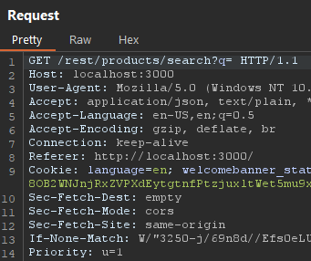


**CWE ID**: 
- [CWE-89: SQL Injection](https://cwe.mitre.org/data/definitions/89.html)

**Severity**: 9.8 (Critical) - Full database access and data exfiltration.


**Remediation**: Use parameterized queries, validate and sanitize inputs, and implement robust access controls.

### 5 - Weak Password Hashing (MD5)

By examining the user table, it was detected that the password hashes are stored using the MD5 hashing algorithm. Using a rainbow table attack via the online tool [CrackStation](https://crackstation.net/), 4 passwords were successfully decrypted. Further research and use of more comprehensive rainbow tables could potentially lead to the decryption of more passwords.


**CWE ID**:
- [CWE-328: Reversible One-Way Hash](https://cwe.mitre.org/data/definitions/328.html)

**Severity**:  9.1 (Critical) - Unauthorized access to user and admin accounts through password decryption.


**Remediation**: Replace MD5 with a more secure hashing algorithm. Additionally, implement salting and peppering techniques to enhance password security.

### 6 - Cross-Site Request Forgery (CSRF) in Change Password Functionality

The change password functionality is vulnerable to CSRF attacks. Using Burp Suite's Repeater tool, the password could be changed directly by altering the request. When the current password value was set incorrectly, it led to an error. However, by removing the current password value, the password change was successfully executed, allowing the attacker to change the password without knowing the actual current password.

- The request with the correct current password successfully changes the password:

    


- The request with an incorrect current password leads to an error:❌

    

- The request without the current password value successfully changes the password: ✅

    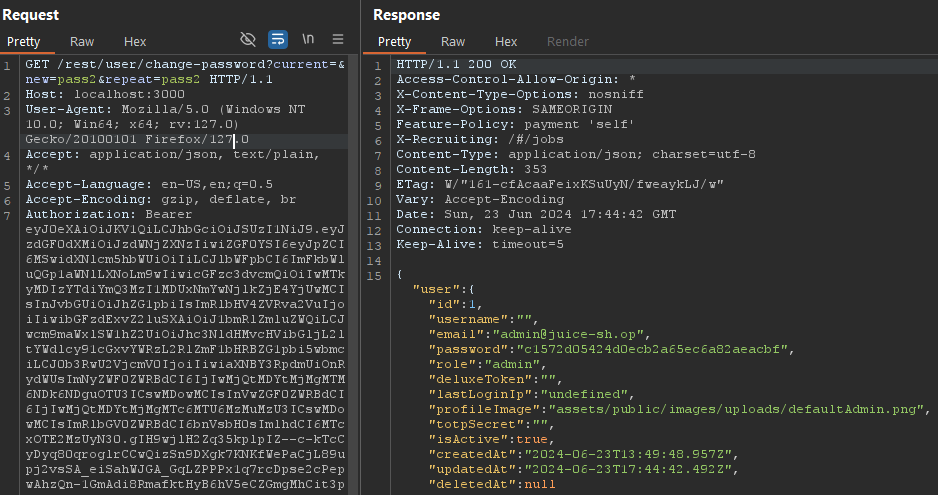


Obs.: The vulnerability did not work on an updated version of Firefox due to built-in browser protections, making it harder to reproduce the attack on a victim's computer. However, other methods, such as using Burp Suite, older browsers, or custom scripts, could still be used to exploit this vulnerability.

**CWE ID**:
- [CWE-352: Cross-Site Request Forgery (CSRF)](https://cwe.mitre.org/data/definitions/352.html)

**Severity**: 8.0 (High) - Unauthorized actions performed on behalf of authenticated users.

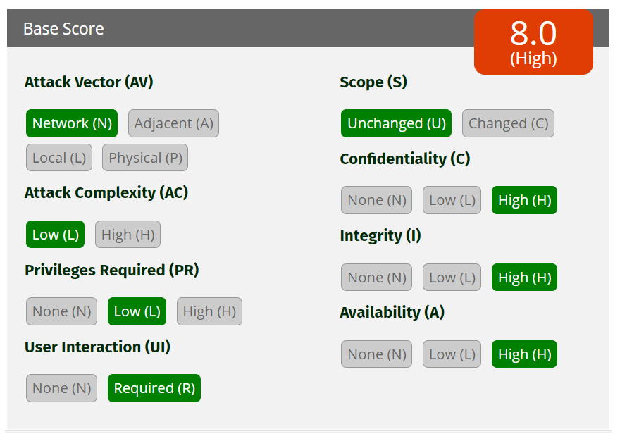

**Remediation**: Implement anti-CSRF tokens to validate the authenticity of requests. Ensure that all state-changing requests require a unique token that is verified on the server-side.

### 7 - DOM XSS in Product Search

The product search functionality is vulnerable to DOM-based XSS. DOM-based XSS occurs when the attack payload is executed as part of the Document Object Model (DOM) on the client side, without any interaction with the server. 

By entering the payload in the browser´s search bar, the application executes the script in the context of the user's browser.

**Payloads:**

1. **Basic Script Alert** ❌
    ```html
    <script>alert('XSS');</script>
    ```
    This payload did not work as the script was sanitized.

2. **Image Tag with onerror Attribute** ✅
    ```html
    
    ```
    This payload triggered an alert box, demonstrating the presence of an XSS vulnerability.

    

3. **Simple Redirect Link** ✅
    ```html
    <a href="https://cesar.school/">Clique</a>
    ```
    This payload created a link that, when clicked, redirected the user to another page.

    

4. **Image Tag with onerror Redirect** ✅
    ```html
    
    ```
    This payload straight redirected the user upon triggering the onerror event.

5. **Cookie Stealing** ✅
   ```html
    <iframe src="javascript:alert(document.cookie)">
    ```
    This payload triggered an alert showing the user's cookies.

    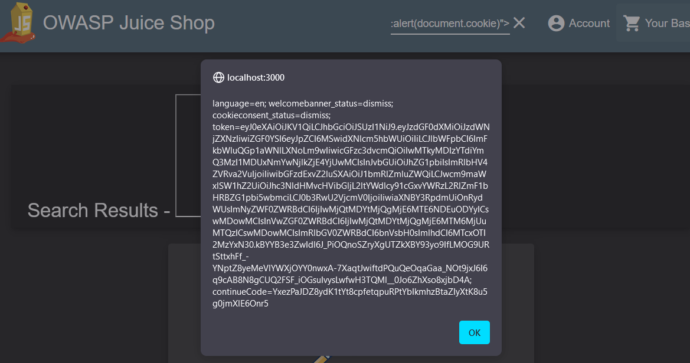

**CWE ID**:
- [CWE-79: Improper Neutralization of Input During Web Page Generation ('Cross-site Scripting')](https://cwe.mitre.org/data/definitions/79.html)

**Severity**: 5.4 (Medium) - Potential to execute arbitrary JavaScript in the user's browser.


**Remediation**: 
Implement proper input validation and output encoding.
Use security libraries and frameworks that handle these issues automatically.

### 8 - Broken Access Control in Basket Functionality

The basket functionality has broken access control vulnerabilities, allowing unauthorized actions on behalf of other users.

**View other users baskets**

By manipulating the request to view a basket, it was possible to access other users baskets. Using Burp Suite's Repeater tool, the HTTP header was modified to `/rest/basket/*`, with `*` being the user ID. This allowed viewing the contents of other users' baskets.

- Original request:

    

- Altered request:

    

- Reponse
  
  The response shows the basket of the user with ID 2:

    

Jim's basket was accessed, revealing his items and personal information.


**Add items to other users baskets**

It was possible to add items to other users baskets by manipulating the request to add an item. This involved intercepting the request and altering the BasketId parameter.

- Original request:

    User `admin`
    
    BasketId `1`

    Product `Eggfruit Juice`
    
    ProductId `3`

    
    
Trying to simply change the `BasketId` to `2` didn´t work, but adding a duplicated `BasketId` parameter with the value `2` worked.

- Altered request:
  
    User `Jim`

    BasketId `2`

    Quantity `10`

    

- Successful Response:
  
    
   

Attempting to add more items to the basket on basket page using a `PUT` request or using Burp Suite's Repeater tool were unsuccessful. The vulnerability could only be exploited through the "Add to Basket" functionality on the main page by intercepting and modifying the request.

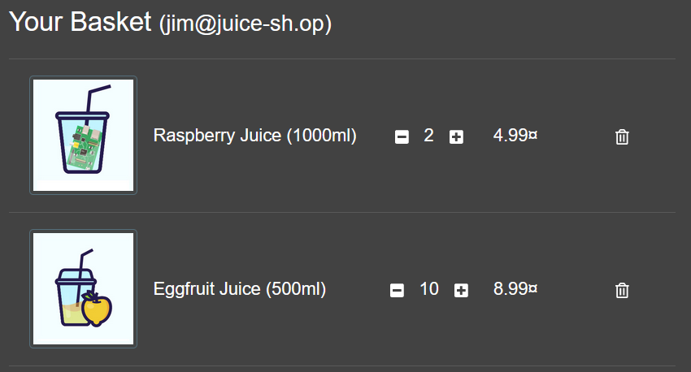


**CWE ID**:
- [CWE-284: Improper Access Control](https://cwe.mitre.org/data/definitions/284.html)

**Severity**: 8.1 (High) - Unauthorized actions performed on behalf of other users, including viewing and modifying basket contents.


**Remediation**: 
Implement proper access control checks on both server-side and client-side.
Validate user permissions for each action to ensure users can only access and modify their own resources.

### 9 - Improper Input Validation in Basket Functionality

The basket functionality is vulnerable to improper input validation. By entering a negative quantity in the basket the application allows the user to proceed with the purchase, resulting in a negative total price.

- Original request:

    


- Altered request:

    Quantity `-10`

    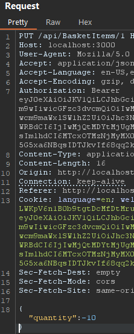

- Successful Response:

    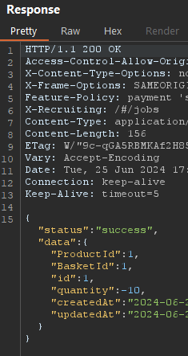

The application allowed the purchase of a negative quantity of items, resulting in a negative total price.
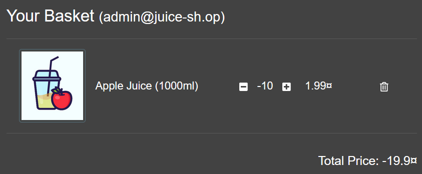

By checking out with a negative quantity using de digital wallet functionality, the user receives money instead of paying for the items.
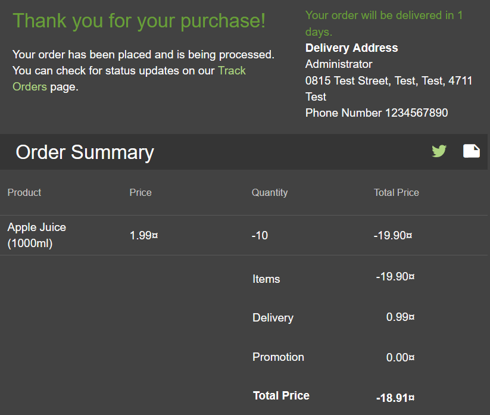


**CWE ID**:
- [CWE-20: Improper Input Validation](https://cwe.mitre.org/data/definitions/20.html)

**Severity**: 6.5 (Medium) - Financial loss due to negative transactions allowed.

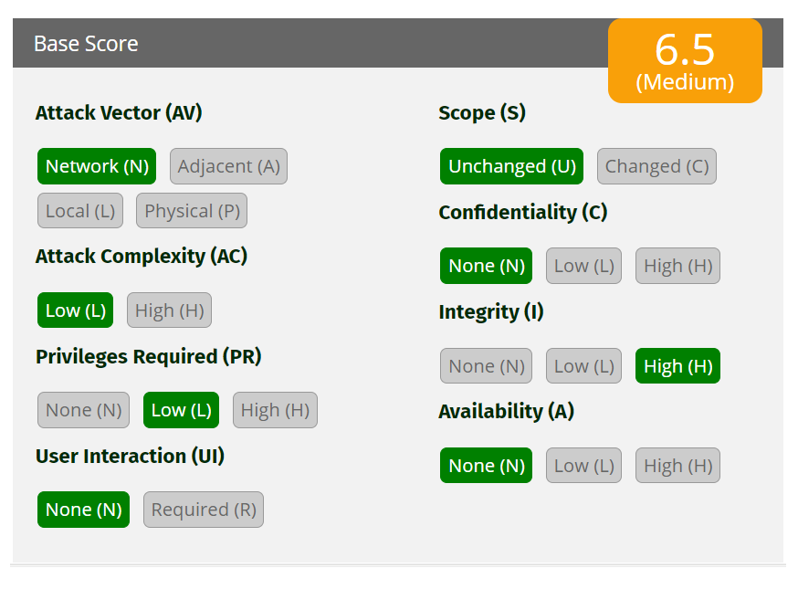

**Remediation**:
Implement proper input validation to ensure only positive quantities are allowed.
Perform server-side checks to validate the quantity before processing transactions.


### 10 - Improper Input Validation in File Upload Functionality

The file upload functionality in the complaint page is vulnerable to improper input validation. The front-end enforces a restriction on file size (maximum 100 KB) and allowed file extensions (`.pdf` and `.zip`). However, these restrictions can be bypassed by manipulating the file extension and size through intercepted requests.

- The interface does not allow files over 100 KB or with extensions other than `.pdf` or `.zip`.

    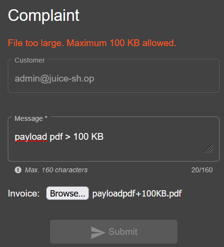

    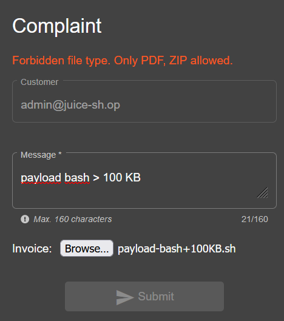


**Changing File Extension:**

- Upload a bash script `payload-script.sh` by changing its extension to `payload-script.sh.zip`.

    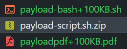

    

**Manipulating Request with Burp Suite:**

- Intercept the upload request using Burp Suite.
- Modify the file extension back to `payload-script.sh` and insert additional data to bypass the 100 KB constraint.

Original Request:


Altered Request:
        
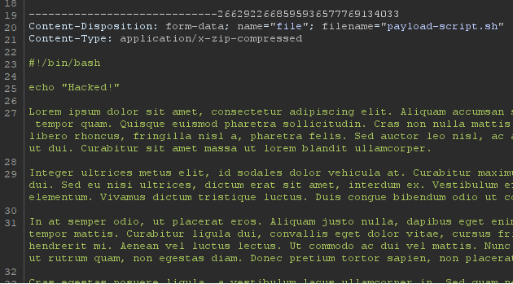

The upload is successfully processed, allowing the malicious file to be uploaded.

**CWE ID**:
- [CWE-20: Improper Input Validation](https://cwe.mitre.org/data/definitions/20.html)

**Severity**: 9.8 (High) - Potential for arbitrary file uploads leading to remote code execution or further exploitation.


**Remediation**:
Implement server-side validation to enforce file size and extension restrictions.

### 11 - Insecure Design and Implementation of JWT

The JSON Web Token (JWT) implementation in OWASP Juice Shop exhibits multiple security issues, including poor handling of tokens and potential exposure of sensitive information.

- Intercepting the request to the `user login` endpoint reveals the JWT token in the response.

    

  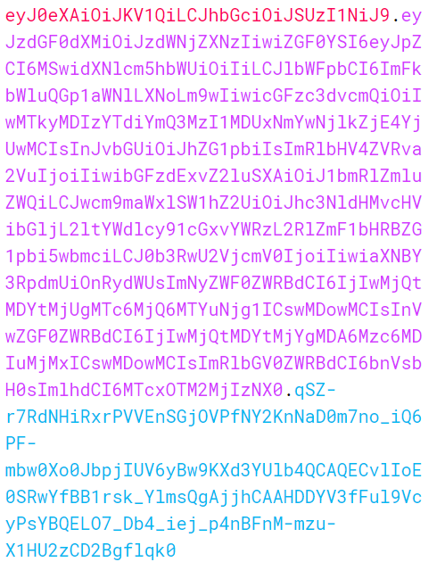  

- Decoding the JWT token using [jwt.io](https://jwt.io/) reveals the user's email address, role, and other sensitive information.
  
    
    
    

- By removing the `"alg"` parameter on the header and the Signature with [JWT Editor Burp Extension](https://portswigger.net/bappstore/26aaa5ded2f74beea19e2ed8345a93dd) and changing the `"id"` parameter to `2`, the token was successfully modified to impersonate another user.
  
    
- Original Response:
  
    


- Modified Response:  
    

**CWE ID**:  

- [CWE-315: Cleartext Storage of Sensitive Information in a Cookie](https://cwe.mitre.org/data/definitions/315.html)
- [CWE-346: Origin Validation Error](https://cwe.mitre.org/data/definitions/346.html)


**Severity**: 7.1 (High) - Sensitive information exposure and potential for token manipulation.


**Remediation**  
  
Avoid storing sensitive information directly in the JWT payload. Use stronger algorithms such as HS512 for token signing and ensure tokens have a short expiration time.

## Author

**Report by**: Pedro Coelho  
**Cesar School**  
**Specialization in Cybersecurity**  
**Web Application Security Course**  
**Instructor**: Petronio Lopes

