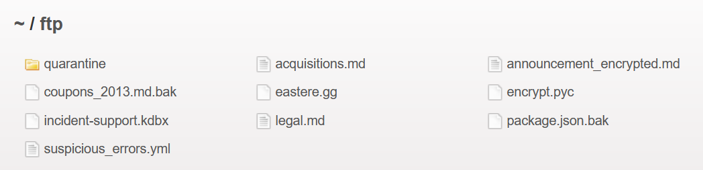
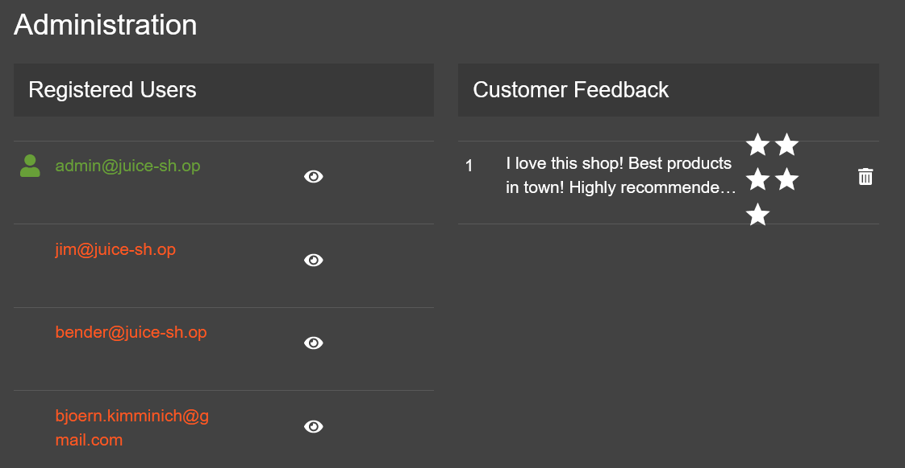
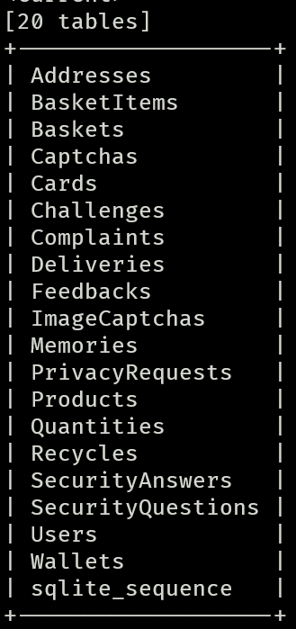
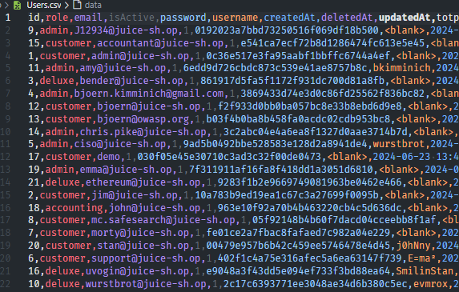

# OWASP Juice Shop Web Application Security Report

## Summary

This report presents a security assessment of the OWASP Juice Shop, an intentionally insecure web application. The assessment includes identifying vulnerabilities, understanding exploitation techniques, evaluating their severity, and suggesting remediation strategies.

Each vulnerability is mapped to its corresponding [CWE (Common Weakness Enumeration)](https://cwe.mitre.org/) and evaluated using the [Common Vulnerability Scoring System (CVSS)](https://www.first.org/cvss/) calculator.

## Reconnaissance

### Burp Suite -> Target -> Site map

---

### 1 - Directory Listing Exposure in '/ftp'

By accessing the `/ftp` directory directly, files available for download can be seen. 

For example, the `acquisitions.md` file contains sensitive information about the company's acquisitions.

**CWE ID**:
- [CWE-538: File and Directory Information Exposure](https://cwe.mitre.org/data/definitions/538.html)

**Severity**: 7.5 (High) - Unauthorized access to sensitive company information.

**Remediation**: Implement proper access control and disable directory listing.

---

### 2. Sensitive Data Exposure in Main.js

Inspecting `main.js` in the developer tools debugger with Pretty Print reveals critical internal information. 

For instance, searching for 'admin' exposes the administration panel, which may displays user information and customer feedback control.

**CWE ID**:
- [CWE-922: Insecure Storage of Sensitive Information](https://cwe.mitre.org/data/definitions/922.html)

**Severity**: 5.3 (Medium) - Exposure of internal endpoints and application logic.

**Remediation**: Minimize information exposure in client-side code and use obfuscation where possible.

## SQL Injection

### 3 - Brute Force SQL Injection Admin Login Bypass

The login form is vulnerable to SQL injection. By entering `' OR 1=1 --` in the Email field and anything in the password field, the application logs in as the first user in the database (the admin user). By exploiting this vulnerability, the attacker can escalate privileges, gaining administrative access to the application and enabling multiple further attacks.

Using Burp Suite Intruder tool configured with a [list](https://book.hacktricks.xyz/pentesting-web/login-bypass/sql-login-bypass) of SQL Injection payloads to automate and test the vulnerability in the login form.

**CWE ID**: 
- [CWE-89: SQL Injection](https://cwe.mitre.org/data/definitions/89.html)

**Severity**: 10 (Critical) - Potential to gain administrative access to the application.

**Remediation**: Implement parameterized queries and use prepared statements.

### 4 - SQL Injection in Product Search

The search field in the application is vulnerable to SQL injection. By using tools like Burp Suite and [SQLMap](https://sqlmap.org/), the entire database schema and data were collected. This included registered credit cards in plain text and all users' information, although passwords were encrypted.

**CWE ID**: 
- [CWE-89: SQL Injection](https://cwe.mitre.org/data/definitions/89.html)

**Severity**: 9.8 (Critical) - Full database access and data exfiltration.

**Remediation**: Use parameterized queries, validate and sanitize inputs, and implement robust access controls.

## Weak Cryptography

### 5 - Weak Password Hashing (MD5)

By examining the user table, it was detected that the password hashes are stored using the MD5 hashing algorithm. Using a rainbow table attack via the online tool [CrackStation](https://crackstation.net/), 4 passwords were successfully decrypted. Further research and use of more comprehensive rainbow tables could potentially lead to the decryption of more passwords.

**CWE ID**:
- [CWE-328: Reversible One-Way Hash](https://cwe.mitre.org/data/definitions/328.html)

**Severity**:  9.1 (Critical) - Unauthorized access to user and admin accounts through password decryption.

**Remediation**: Replace MD5 with a more secure hashing algorithm. Additionally, implement salting and peppering techniques to enhance password security.

## Cross Site Request Forgery

## Cross Site Scripting

Colocar o produto negativo para add a wallet

### /rest/products/1/reviews
