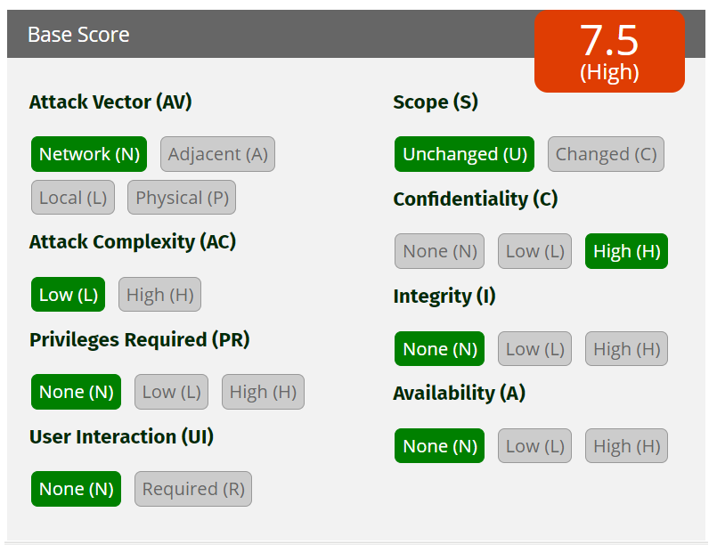
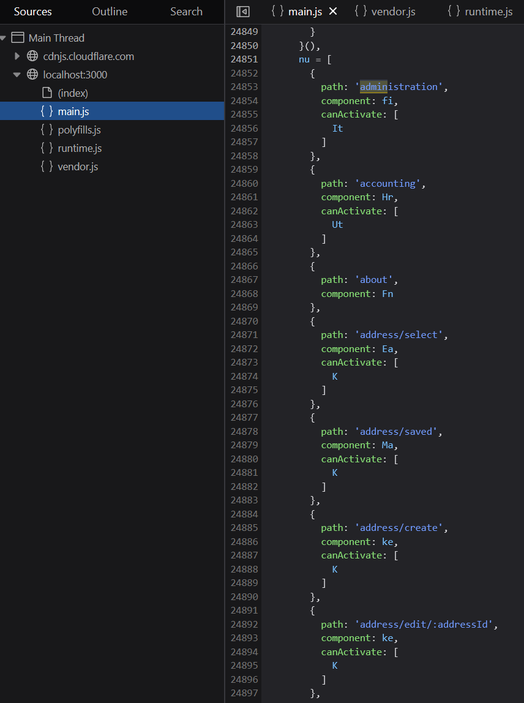

# OWASP Juice Shop Web Application Security Report

## Summary

This report presents a security assessment of the OWASP Juice Shop, an intentionally insecure web application. The assessment includes identifying vulnerabilities, understanding exploitation techniques, evaluating their severity, and suggesting remediation strategies.

Each vulnerability is mapped to its corresponding [CWE (Common Weakness Enumeration)](https://cwe.mitre.org/) and evaluated using the [Common Vulnerability Scoring System (CVSS)](https://www.first.org/cvss/) calculator.

## Mapping the Application

### Burp Suite -> Target -> Site map

---

### 1 - Directory Listing Exposure in '/ftp'

By accessing the `/ftp` directory directly, files available for download can be seen. For example, the `acquisitions.md` file contains sensitive information about the company's acquisitions.

**CWE ID**:
- [CWE-538: File and Directory Information Exposure](https://cwe.mitre.org/data/definitions/538.html)

**Severity**: 7.5 (High) - Unauthorized access to sensitive company information.

**Remediation**: Implement proper access control and disable directory listing.

---

### 2. Sensitive Data Exposure in Main.js

Inspecting `main.js` in the developer tools debugger with Pretty Print reveals critical internal information. For instance, searching for 'admin' exposes the administration panel, which may displays user information and customer feedback control.

**CWE ID**:
- [CWE-922: Insecure Storage of Sensitive Information](https://cwe.mitre.org/data/definitions/922.html)

**Severity**: 5.3 (Medium) - Exposure of internal endpoints and application logic.

**Remediation**: Minimize information exposure in client-side code and use obfuscation where possible.

---

### /rest/products/1/reviews

## SQL Injection

### 3 - Admin Login Bypass

The login form is vulnerable to SQL injection. By entering `' OR 1=1 --` in the Email field and anything in the password field, the application logs in as the first user in the database (the admin user). By exploiting this vulnerability, the attacker can escalate privileges, gaining administrative access to the application and enabling multiple further attacks.

**CWE ID**: [CWE-89: SQL Injection](https://cwe.mitre.org/data/definitions/89.html)

**Severity**: 10 (Critical) - Potential to gain administrative access to the application.

**Remediation**: Implement parameterized queries and use prepared statements.

---

## Cross Site Scripting

Colocar o produto negativo para add a wallet
